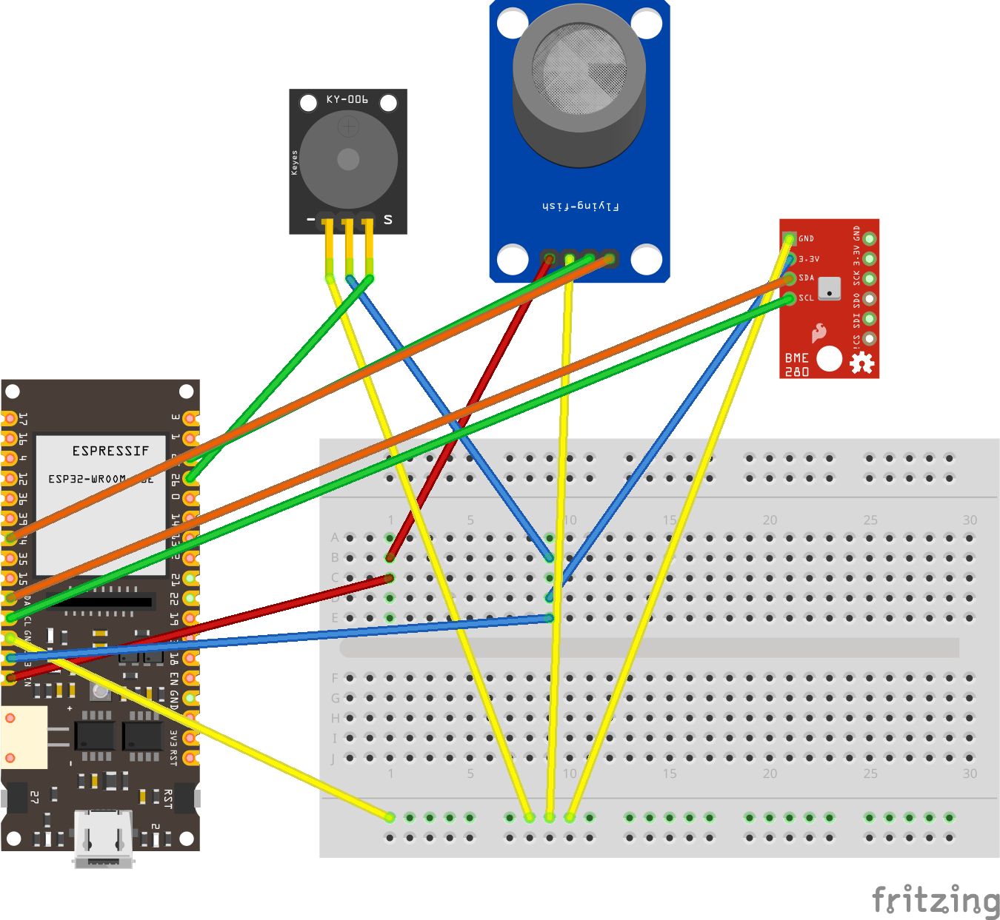
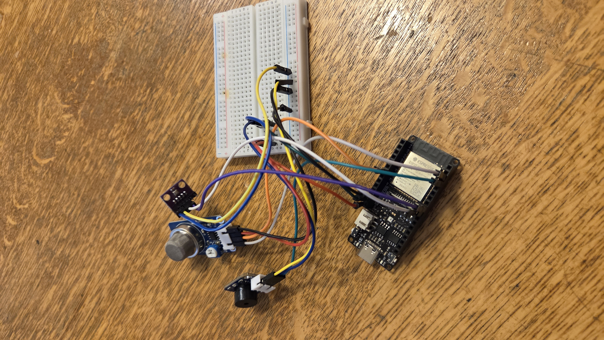

# Real-Time Air Monitoring System

## Overview

This project is an IoT-based air quality and environmental monitoring system designed to detect potentially dangerous gas levels and provide real-time environmental data.

The system uses an ESP32 microcontroller connected to an MQ-2 gas sensor and a BME280 environmental sensor to collect telemetry data such as gas concentration, temperature, humidity, and pressure.

Telemetry data is transmitted using MQTT, processed by an ASP.NET Core backend, stored in a PostgreSQL database, and displayed in real time through a React frontend dashboard using Server-Sent Events (SSE).

## Live Application

Frontend: https://airmonitoring.fly.dev/

Backend: https://airmonitoringserver.fly.dev

## Features

The system allows users to:

* monitor gas concentration levels in real time
* monitor temperature, humidity, and pressure
* receive alerts when dangerous gas levels are detected
* visualize telemetry data through charts and dashboards
* store telemetry history in a PostgreSQL database
* receive live frontend updates using Server-Sent Events (SSE)

## How the Solution Works

The ESP32 continuously reads data from the MQ-2 gas sensor and BME280 sensor.

The ESP32 connects to Wi-Fi and publishes telemetry data to an MQTT broker using MQTT over Wi-Fi.

The ASP.NET Core backend subscribes to the MQTT topic, processes incoming telemetry data, and stores the data in a PostgreSQL database using Entity Framework Core.

The backend exposes API endpoints and pushes live telemetry updates to the React frontend using Server-Sent Events (SSE).

If dangerous gas levels exceed a predefined threshold, the system activates a buzzer alarm and displays a warning in the frontend dashboard.

## Technologies Used

### Hardware

* ESP32 (DFRobot FireBeetle 2 ESP32-E)
* MQ-2 Gas Sensor
* BME280 Environmental Sensor
* Buzzer

### Backend

* .NET 10
* C#
* ASP.NET Core Web API
* Entity Framework Core
* PostgreSQL
* MQTT
* StateleSSE.AspNetCore
* Mqtt.Controllers

### Frontend

* React
* TypeScript
* Vite
* Recharts
* CSS

### DevOps / Deployment

* Fly.io
* fly.toml configuration
* Neon PostgreSQL

## Project Structure

* server/api – ASP.NET Core API, MQTT subscription, SSE, telemetry handling
* server/dataaccess – Entity Framework Core database layer and models
* client – React frontend dashboard and charts
* esp32 – ESP32 firmware and sensor integration

## Hardware Wiring
The diagram below shows how the ESP32 is connected to the MQ-2 gas sensor, BME280 sensor, buzzer, and breadboard.

## Development Process

The project was developed as a full-stack IoT system combining embedded programming, backend development, database management, and frontend visualization.

The development process included:

* configuring and programming the ESP32
* integrating the MQ-2 and BME280 sensors
* publishing telemetry data through MQTT
* developing a backend API in ASP.NET Core
* storing telemetry data in PostgreSQL
* implementing real-time updates using SSE
* developing a React dashboard for visualization
* deploying the frontend and backend using Fly.io

## Future Improvements
* Implement ntfy notifications for mobile push alerts when dangerous gas levels are detected.
* Expand alarm handling and notification customization.

## Summary

This project demonstrates how IoT technologies can be used to create a real-time air monitoring and gas detection system using modern full-stack technologies.

Created by ELK:
* Ali Emre Uzunoglu
* Katja Tamstrup Strunck
* Laura Shpakova
